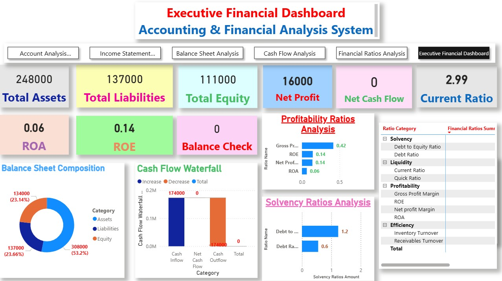

# 📊 Power BI Financial Analysis Dashboard

## Project Overview
This project is an interactive Financial Analysis Dashboard developed using Power BI. It provides a comprehensive view of a company's financial performance through dynamic reports, KPIs, and financial statements.

## Dashboard Features
- Executive Financial Dashboard
- Account Analysis Dashboard
- Balance Sheet Analysis
- Cash Flow Analysis
- Financial Ratios Analysis
  
## Dashboard Preview

## Key Performance Indicators (KPIs)
- Total Assets
- Total Liabilities
- Total Equity
- Net Profit
- Net Cash Flow
- Current Ratio
- ROA
- ROE
- Balance Check

## Technologies Used
- Power BI
- DAX
- Microsoft Excel
- Power Query
- Microsoft Access
- SQL
- Python
- AI Tools

## Accounting Concepts
- Chart of Accounts
- Journal Entries
- General Ledger
- Trial Balance
- Income Statement
- Balance Sheet
- Cash Flow Statement
- Financial Ratios

## Author
Mostafa Hisham
## Author
*Mostafa Hisham*
